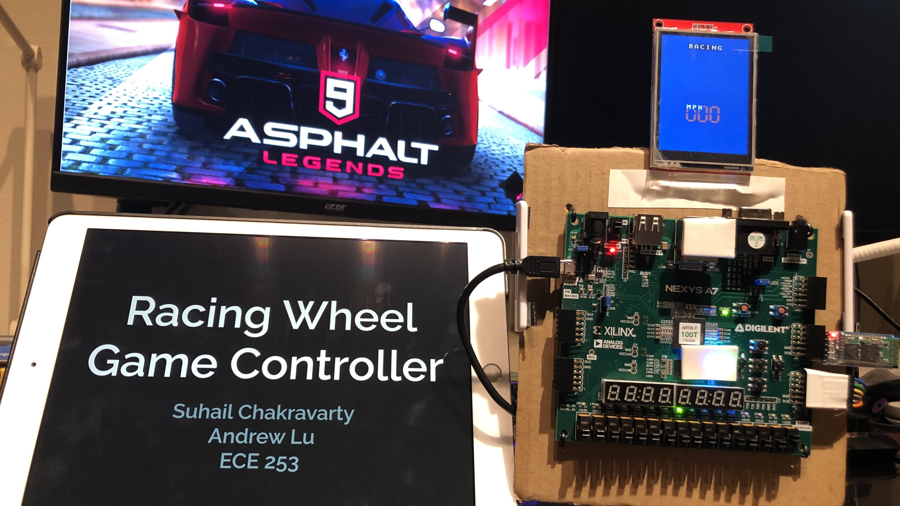
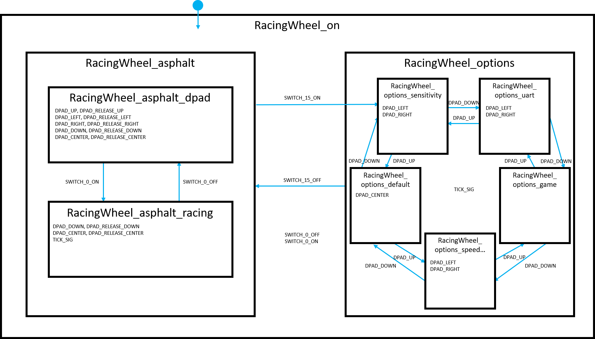

# Racing Wheel Game Controller

Suhail Chakravarty, Andrew Lu

ECE 253, Fall 2020, Professor Brewer.

[View repository on GitHub](https://github.com/andrewhlu/racing-wheel)

---

Racing Wheel Game Controller Demo Video: [https://www.youtube.com/watch?v=vX0i1uezqp4](https://www.youtube.com/watch?v=vX0i1uezqp4)

[Intial Project Proposal](./proposal)

[Final Project Report](final-report.pdf)

---

## Overview

The purpose of this project is to design a Racing Wheel that can be used to play racing games using an FPGA, an accelerometer peripheral, and an LCD display. For this project, it is important that the game is reasonably playable, the board is easily configurable, and the experience is comparable to a real-world racing wheel controller or even a real-world car.



## Parts List

| Part | Quantity | Unit Price | Total Price |
|------|----------|------------|-------------|
| [Nexys A7-100T FPGA Development Board](https://store.digilentinc.com/nexys-a7-fpga-trainer-board-recommended-for-ece-curriculum/) | 1 | $198.75* | $198.75 |
| [HiLetgo ILI9341 2.8" SPI TFT LCD Display](https://www.amazon.com/dp/B073R7BH1B/) | 1 | $13.99 | $13.99 |
| [HC-05 Bluetooth Module (optional)](https://www.amazon.com/dp/B00INWZRNC/) | 1 | $10.90 | $10.90 |
| **TOTAL** |   |   | **$223.64** |

\* With academic discount

## Software Requirements

A Windows 10 computer is required to download the game and run the Python script.

The following programs are needed:
* [Asphalt 9: Legends](https://www.microsoft.com/en-us/p/asphalt-9-legends/9nzqpt0mwtd0)
* [Vivado 2019.1.3 and Xilinx SDK](https://www.xilinx.com/products/design-tools/vivado.html)
* [Python 3](https://www.microsoft.com/en-us/p/python-39/9p7qfqmjrfp7)
  * Required pip modules: 
    * [pyautogui](https://pypi.org/project/PyAutoGUI/)
    * [pyserial](https://pypi.org/project/pyserial/)
    * [pytesseract](https://pypi.org/project/pytesseract/)
* [Tesseract OCR for Windows](https://github.com/UB-Mannheim/tesseract/wiki)
  * When installing, ensure that you select "Install for all users" and that the install location is `C:\Program Files\Tesseract-OCR\tesseract`

You will also need a Bluetooth adapter if you wish to use Bluetooth UART instead of USB UART.

## Python Script Usage

First, `cd` into the directory containing the Python script. Make sure you are doing it from Command Prompt, PowerShell, or Git Bash, and not Windows Subsystem for Linux (WSL).

Then, run this command to start the Python script, substituting your controller's COM port. (If you are unsure of what this is, you can use Device Manager or a program such as Tera Term to find this)

```
python server.py <COM port (e.g. "COM1")>
```

(If you have both Python 2 and 3 installed, you may need to run with `python3` instead)

## HSM Diagram

This project was implemented using the QP-Nano framework. The state machine for our implementation is pictured here:



## Python Script Commands

* 1-15: Accelerometer
* 16-17: Up (press / release)
* 18-19: Left (press / release)
* 20-21: Right (press / release)
* 22-23: Down (press / release)
* 24-25: Space (press / release)
* 26-27: Enter (press / release)
* 28: Release All
* 29-30: Speedometer (on / off)